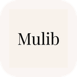
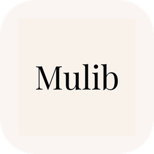

<div align="center">



# Build your personal music library with Mulib.

**Search for songs, artists or albums and download them to your local library.<br>You have full control over your music.**

[Quick start](#quick-start) · [Demo](#demo) · [FAQ](#faq)

[](https://github.com/marbinkaraus/mulib/releases/latest)
[](https://github.com/marbinkaraus/mulib/stargazers)
[](https://github.com/marbinkaraus/mulib/issues)

</div>

> [!IMPORTANT]
> **What it is:** an **educational / test** project—a hands-on example of how **local music library software** could work (search, library UI, files on disk), not a commercial music service. See **[docs/DISCLAIMER.md](docs/DISCLAIMER.md)** for how that fits with lawful use.

---

## Quick start

1. Open [**Releases**](https://github.com/marbinkaraus/mulib/releases) and download Mulib for your Mac (**Apple Silicon** or **Intel**, matching your Mac).
2. Open the disk image or zip and drag **Mulib** into your **Applications** folder.
3. **Before the first launch**, open **Terminal** and run the command below to **remove the quarantine flag** (only if you trust this download from **Releases**). Doing this **before** you open Mulib avoids macOS showing the security error dialog. Release builds are **not** signed (sorry, I dont want to pay for a certificate), so this step is required:

```bash
xattr -dr com.apple.quarantine "/Applications/Mulib.app"
```

*Change the path if **Mulib.app** is not in `/Applications` (for example if you copied it somewhere else or it’s still in **Downloads**).*

4. **Open Mulib** from **Applications** (or **Finder**). Your music is saved in `Music/mulib/`.

---

## Demo

<div align="center">



*Screen recording and screenshots coming soon*

</div>

---

## FAQ

> [!CAUTION]
> **Music and downloads:** Mulib is shared for **testing and learning** how local music software can work; it does **not** give you permission to infringe copyright or break the law. **You are solely responsible** for what you download and whether that use is legal where you live and under the platforms’ rules. The maintainers **do not** encourage piracy and **are not liable** for your choices. Read the full **[disclaimer](docs/DISCLAIMER.md)** before using the app.

<details>
<summary><strong>Is this app “for real” use or just testing?</strong></summary>

It’s built as an **educational and technical demo**: a **testbed** for ideas you’d see in **real** music apps (local library, search, downloads)—useful for **experimenting** and understanding how such software could work. It is **not** a licensed commercial streaming product. **Lawful use** (including what you may download) is still **your** responsibility; see **[docs/DISCLAIMER.md](docs/DISCLAIMER.md)**.

</details>

<details>
<summary><strong>Is downloading music with Mulib legal?</strong></summary>

**It depends on what you download, where you live, and what rights you have.** Downloading copyrighted tracks without permission from the rightsholder (or without another valid legal basis) **may be illegal** in many places and can **violate service terms**. This project **does not** provide legal advice. If you are unsure, **do not download** until you know you are allowed to. Details: **[docs/DISCLAIMER.md](docs/DISCLAIMER.md)**.

</details>

<details>
<summary><strong>What does Mulib do?</strong></summary>

It helps you **find music** and **download it to your Mac** so you can build a **local library** you control—the kind of flow a **real** desktop music app might implement. The project is aimed at **learning and testing** that architecture; see **[docs/DISCLAIMER.md](docs/DISCLAIMER.md)** for how to use it responsibly.

</details>

<details>
<summary><strong>Do I need a subscription?</strong></summary>

Mulib is **free software** from this repository. There is no paid subscription for the app itself. Your obligations around content, copyright, and lawful use are in **[docs/DISCLAIMER.md](docs/DISCLAIMER.md)** and the caution note above.

</details>

<details>
<summary><strong>Which Macs work?</strong></summary>

Mulib is built for **macOS**. Use the **Releases** page to pick the right download for **Apple Silicon** or **Intel** when both are offered.

</details>

<details>
<summary><strong>Something’s broken or I have an idea</strong></summary>

Open an [**Issue**](https://github.com/marbinkaraus/mulib/issues) on GitHub. For **security-sensitive** problems, please use [**Security advisories**](https://github.com/marbinkaraus/mulib/security) instead of a public issue.

</details>

---

## Acknowledgements

Mulib stands on great open tools and libraries, including [**Tauri**](https://tauri.app/), [**yt-dlp**](https://github.com/yt-dlp/yt-dlp), [**ytmusicapi**](https://github.com/sigma67/ytmusicapi), and [**python-build-standalone**](https://github.com/astral-sh/python-build-standalone). Thank you to everyone who builds and maintains them.

---

## Legal

> [!NOTE]
> This section summarizes how the project is offered; it is **not** legal advice.

- **[Disclaimer](docs/DISCLAIMER.md)** — **Purpose** (educational / testing demo of local music software), **music and downloads** (sole user responsibility; no permission to infringe copyright; maintainers not liable), no warranty, no affiliation with YouTube/Google. Full text also covers the [MIT License](LICENSE).
- **[Third-party notices](docs/THIRD_PARTY_NOTICES.md)** — Licenses for bundled dependencies (Python, yt-dlp, ytmusicapi, etc.).
- **[Security](docs/SECURITY.md)** — How to report a **security vulnerability** privately ([GitHub Security](https://github.com/marbinkaraus/mulib/security)).

---

## License

Mulib’s **source code** is licensed under the [MIT License](LICENSE). Bundled third-party components (for example Python, **yt-dlp**, **ytmusicapi**, and other dependencies) remain under their respective licenses — see **[docs/THIRD_PARTY_NOTICES.md](docs/THIRD_PARTY_NOTICES.md)** for a maintained list and pointers to upstream license text.

---

<div align="center">

**Your library, your Mac, your rules.**

<br />

Made for listening on your terms.

</div>
